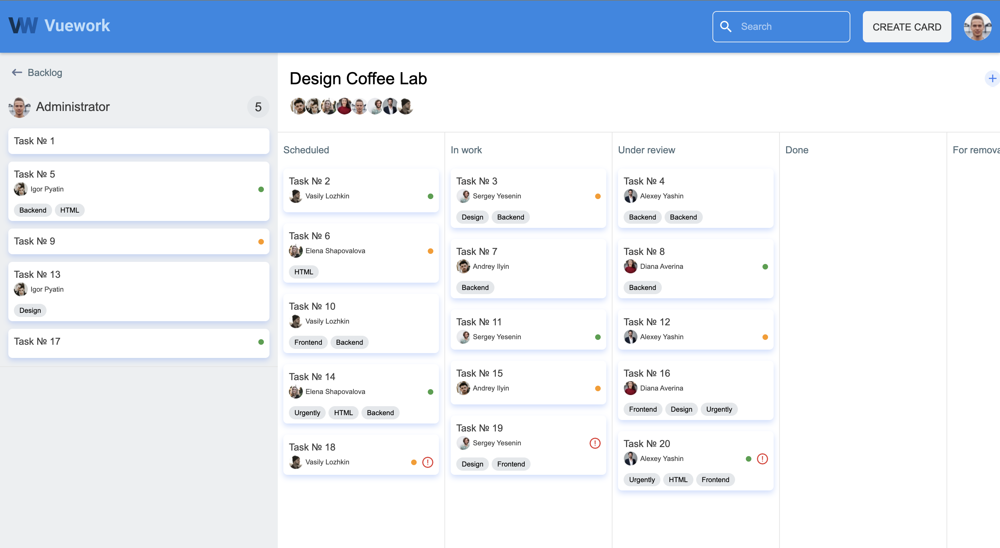
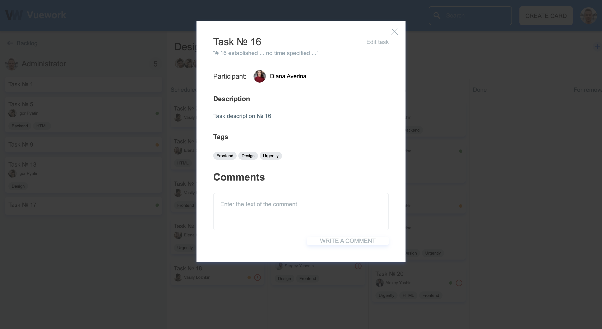
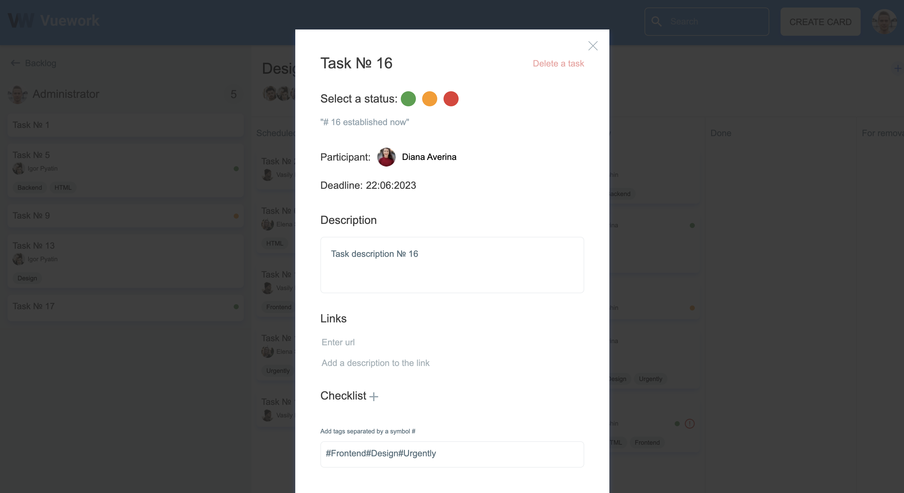

# VueWork: Task Manager

[](https://github.com/yourusername/task-manager/actions/workflows/ci.yml)
[](backend/tests)
[](frontend/src)
[](https://php.net)
[](https://symfony.com)
[](https://vuejs.org)

Full-stack task manager with Kanban board, JWT authentication, and real-time drag-and-drop.





---

## Quick Start

```bash
# 1. Clone and setup
git clone <repo-url>
cd task-manager

# 2. Create environment files
cp docker/.env.example docker/.env
cp backend/.env.example backend/.env

# 3. Start everything
make start

# 4. Load demo data (first time only)
make fixtures
```

**Open** http://localhost:8088

**Login:** `admin@example.com` / `admin123`

---

## Tech Stack

| Layer | Technology |
|-------|-----------|
| **Backend** | Symfony 7.2, PHP 8.4, Doctrine ORM, PostgreSQL 16 |
| **Frontend** | Vue 3.5, Pinia 2.3, Vue Router 4.6, Vite 6.4 |
| **Auth** | JWT (LexikJWTAuthenticationBundle) |
| **API Docs** | OpenAPI 3.0 (NelmioApiDocBundle) |
| **Tests** | PHPUnit 11 (backend), Vitest 2 (frontend) |

---

## Architecture

### Backend — Clean Architecture

```
src/
├── Domain/          # Entities, value objects, repository interfaces
│   ├── Entity/      # User, Task, Column, Comment, Tick
│   ├── Exception/   # Domain exceptions
│   └── Repository/  # Interfaces (no framework deps)
├── Application/     # Use cases, DTOs, services
│   ├── Dto/         # Request/Query DTOs with validation
│   └── Service/     # Business logic (no Doctrine in services)
├── Infrastructure/  # Framework-specific code
│   ├── Persistence/ # Doctrine repositories, migrations
│   ├── Http/        # Exception subscriber, normalizers
│   └── Serializer/  # Custom normalizers
└── Controller/      # Thin controllers, delegate to Application layer
```

Key decisions:
- **No manual transactions** — Doctrine auto-commit + implicit transactions
- **Symfony Serializer** instead of custom EntitySerializer
- **DTOs for all inputs** — validated before reaching domain
- **Custom normalizer** for User to avoid Security/UserNormalizer conflict

### Frontend — Modular Architecture

```
src/
├── services/        # HTTP layer (HttpClient + FetchProvider)
│   ├── providers/   # FetchProvider with interceptors
│   └── *-service.js # Resource-specific services
├── stores/          # Pinia stores with DRY pattern
│   └── (withLoading helper for loading/error states)
├── modules/         # Feature modules
│   ├── columns/     # DeskColumn component
│   └── tasks/       # TaskCard, TaskCardCreator, etc.
├── common/          # Shared utilities
│   ├── helpers.js   # Pure functions (tested)
│   ├── composables.js
│   └── directives.js
└── layouts/         # Dynamic layout system
```

Key decisions:
- **HttpClient pattern** — provider abstraction for testability
- **withLoading() helper** — eliminates loading/error boilerplate in stores
- **Service normalization** — frontend enriches API data (status, timeStatus)

---

## API Documentation

OpenAPI JSON: http://localhost:3010/doc.json  
Swagger UI: http://localhost:3010/doc

### Endpoints

| Resource | Endpoints |
|----------|-----------|
| Auth | `POST /login`, `POST /signup`, `GET /whoAmI`, `DELETE /logout` |
| Tasks | `GET /tasks`, `POST /tasks`, `GET /tasks/{id}`, `PUT /tasks/{id}`, `DELETE /tasks/{id}` |
| Columns | `GET /columns`, `POST /columns`, `PUT /columns/{id}`, `DELETE /columns/{id}` |
| Comments | `GET /comments`, `POST /comments` |
| Ticks | `GET /ticks`, `POST /ticks`, `PUT /ticks/{id}`, `DELETE /ticks/{id}` |
| Users | `GET /users` |
| Health | `GET /health` |

### Query Parameters

- **Pagination:** `limit` (default 20, max 200), `offset` (default 0)
- **Sorting:** `sort`, `order=asc|desc`
- **Filters:** `columnId`, `statusId`, `q` (search)

---

## Development

### Ports

| Service | URL | Description |
|---------|-----|-------------|
| Nginx Proxy | http://localhost:8088 | Single entry point |
| Backend API | http://localhost:3010 | Direct backend access |
| Frontend Dev | http://localhost:8090 | Vite dev server |
| Database | localhost:5434 | PostgreSQL |

### Makefile Commands

```bash
make start              # Build and start all containers
make stop               # Stop containers
make reset              # Stop and remove volumes (clean slate)
make logs               # Tail compose logs

# Backend
make backend-shell      # Shell into backend container
make migrate            # Run Doctrine migrations
make fixtures           # Load demo data
make cache-clear        # Clear Symfony cache
make backend-tests      # Run PHPUnit
make phpstan            # Static analysis
make cs-fix             # Fix code style
make cs-check           # Check code style

# Frontend
make frontend-tests     # Run Vitest
make lint-frontend      # Run ESLint + Prettier
make install-frontend   # npm ci

# Quality gates
make quality            # Run all checks (cs-check, phpstan, backend-tests, lint-frontend, frontend-tests)
```

---

## Testing

### Backend (PHPUnit)

```bash
cd backend
php vendor/bin/phpunit
```

- **113 tests**, 230 assertions
- Tests cover: controllers, services, repositories, DTOs, validation

### Frontend (Vitest)

```bash
cd frontend
npm run test:unit
```

- **146 tests** across 14 test files
- Tests cover: stores, services, helpers, composables, directives, components

### E2E (Playwright)

```bash
# Manual verification via browser
# Login, CRUD tasks/columns, drag-and-drop all verified
```

---

## Docker Services

```yaml
db:            # PostgreSQL 16
backend:       # PHP 8.4-FPM + Symfony
backend-nginx: # Nginx for backend (port 3010)
frontend:      # Node 20 + Vite dev server (port 8090)
nginx:         # Reverse proxy (port 8088)
```

---

## Project Structure

```
.
├── backend/           # Symfony application
│   ├── src/
│   ├── tests/
│   ├── config/
│   └── migrations/
├── frontend/          # Vue 3 application
│   ├── src/
│   ├── public/
│   └── dist/
├── docker/            # Docker configs
│   ├── backend/
│   ├── frontend/
│   └── nginx/
├── presentation/      # Screenshots
├── docker-compose.yml
└── Makefile
```

---

## License

MIT
